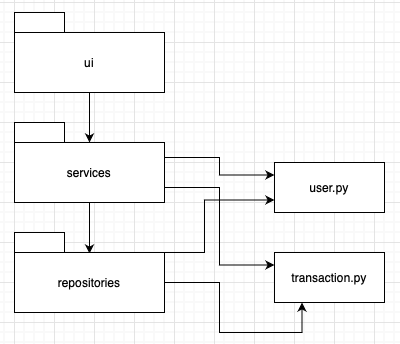
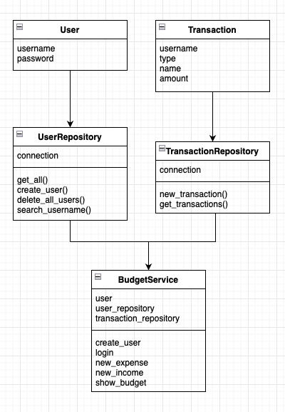

# Architecture

## Packaging

The package _ui_ contains source code for the user interface, _services_ contains logic of the application and _repositories_ contains database communication with the app. The file _user.py_ contains a class for the User object and _transaction.py_ will contain a class for a cost or an expense object.

## Class diagram

